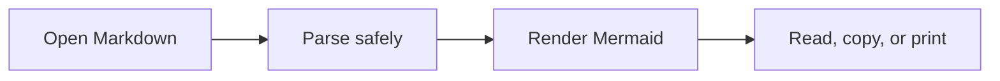
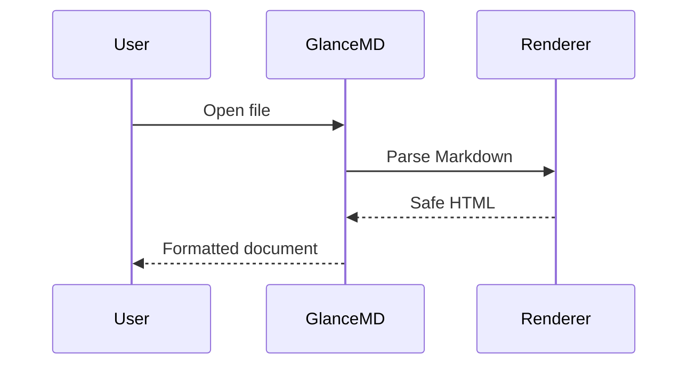

# GlanceMD Reference

This fixture contains **bold**, *emphasis*, ~~strikeout~~, `inline code`, [an external link](https://example.com), and Unicode: नमस्ते · 你好 · مرحبًا · 🌍.

> A block quote used for visual and print testing.

## Lists

- First item
  - Nested item
- [x] Completed task
- [ ] Pending task

## Table

| Feature | Expected result |
|---|---|
| Markdown | Formatted safely |
| Mermaid | Rendered offline |
| Source | Never modified |

## Code

```csharp
public static string Hello(string name) => $"Hello, {name}!";
```

## Mermaid flowchart



## Mermaid sequence



## Invalid Mermaid

```mermaid
this is intentionally not a valid diagram
```

## Long content

`ThisIsA deliberately long code-like line used to verify wrapping and horizontal overflow behavior when printing: 0123456789ABCDEFGHIJKLMNOPQRSTUVWXYZ0123456789ABCDEFGHIJKLMNOPQRSTUVWXYZ0123456789ABCDEFGHIJKLMNOPQRSTUVWXYZ.`

[^note]: A footnote used to verify advanced Markdown rendering.
